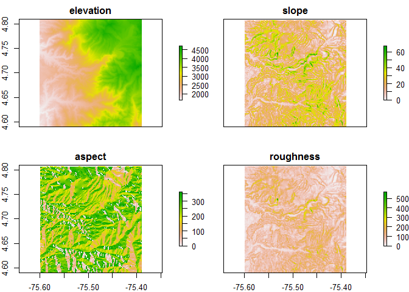
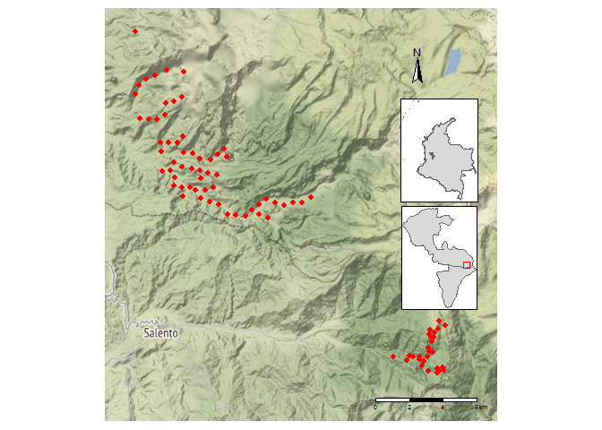
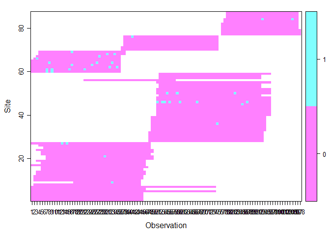
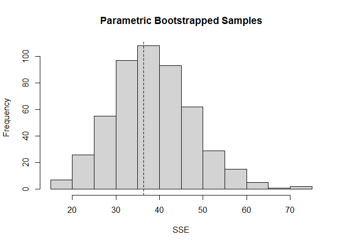
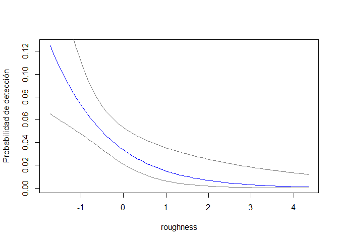
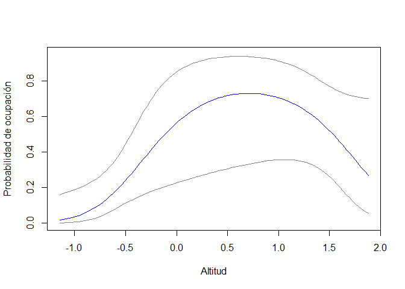
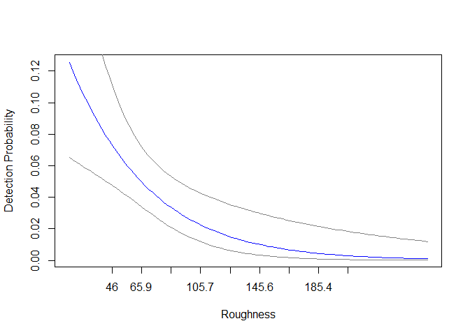
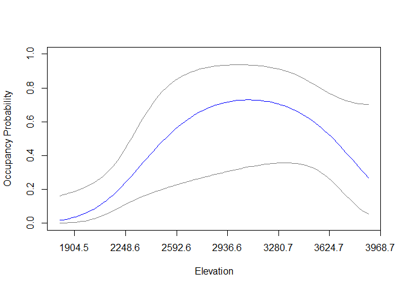
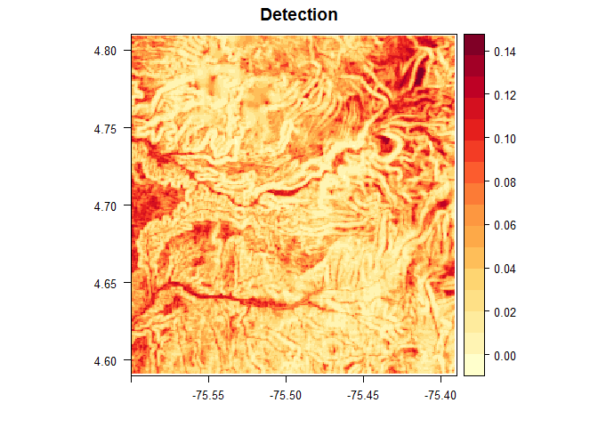
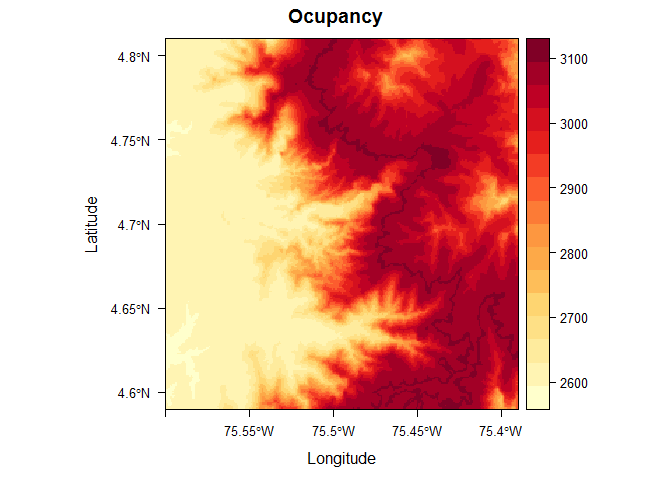

Elevation as an occupancy determinant of the little red brocket deer
(*Mazama rufina*) in the Central Andes of Colombia
================
Diego J. Lizcano, Silvia J. Alvarez, Vanessa Diaz, Diego R. Gutierrez and
Hugo Mantilla
22/01/2020

## Code and data for the article: Elevation as an occupancy determinant of the little red brocket deer (*Mazama rufina*) in the Central Andes of Colombia. [https://doi.org/10.15446/caldasia.v43n2.85449](https://doi.org/10.15446/caldasia.v43n2.85449)

[](https://zenodo.org/badge/latestdoi/331035705)


### load packages

``` r
library (raster) # raster
library (sf) # vector maps
library (unmarked) # Occupancy
library (tidyverse) # data manipulation
library (lubridate) # dates
library (readxl) # read excel
library (readr) # read csv
library (tmap) # nice maps
library (tmaptools) # more maps
library (osmdata) # read osm data
library (OpenStreetMap) # osm maps 
library (grid) # mix maps
library (GADMTools) # subset GADM
library (rasterVis) # improve raster vis
```

### Load data

``` r
# read photo data in object y_full. Columns are days and rows sites
# load("data/y_full.RData") # if you got the repo in hard disk
ydata <- "https://github.com/dlizcano/Mazama_rufina/blob/main/data/y_full.RData?raw=true"
load(url(ydata))

# read camera location
# cams_loc_QR <- read.csv("data/cams_location.csv") # if you got the repo in hard disk
camdata <- "https://raw.githubusercontent.com/dlizcano/Mazama_rufina/main/data/cams_location.csv"
cams_loc_QR <- read_csv(url(camdata))

```

### Initial Spatial Manipulation

``` r
# convert to sf
cams_loc_QR_sf <- st_as_sf(cams_loc_QR, coords = c("Longitud", "Latitud"), crs = "+proj=longlat +datum=WGS84 +no_defs")

centroid <- c(mean(cams_loc_QR$Longitud), mean(cams_loc_QR$Latitud))
clip_window <- extent(-75.60 , -75.39, 4.59, 4.81)
bb <- c(-75.60, 4.59, -75.39,  4.81)

# get spatial data
srtm <- raster::getData('SRTM', lon=centroid[1], lat=centroid[2])

# crop the  raster using the vector extent
srtm_crop <- crop(srtm, clip_window)

# elevation.crop and terrain covs
elevation <- srtm_crop
slope<-terrain(srtm_crop, opt="slope", unit='degrees', neighbors=8)
aspect<-terrain(srtm_crop, opt="aspect", unit='degrees', neighbors=8)
roughness <- terrain(srtm_crop, opt = c("roughness"))

cov.stack<-stack(elevation, slope, aspect, roughness)
names(cov.stack) <- c("elevation", "slope", "aspect", "roughness" )
plot(cov.stack)
```

<!-- -->

``` r
# extract covariates
cam_covs <- raster::extract(cov.stack, cams_loc_QR_sf)
full_covs <- as.data.frame(cam_covs) # convert to Data frame
full_covs_1 <- scale(full_covs)
full_covs_s <- as.data.frame(full_covs_1)
full_covs_s$camara <- cams_loc_QR$camara # add camera name
```

### Study area figure 1

``` r
########## figure 1
data_box <- st_as_sfc(st_bbox(cams_loc_QR_sf)) #bounding box

# pal = mapviewPalette("mapviewTopoColors")
# get fondo de osm
andes_osm1 <- read_osm(bb, zoom = NULL, type="stamen-terrain", mergeTiles = TRUE) # type puede ser tambien bing, osm # type puede ser tambien bing, osm
colombia <-  gadm_sf_loadCountries("COL", level=1, basefile="./")
collimit <- gadm_sf_loadCountries("COL", level=0, basefile="./")

deptos <- gadm_subset(colombia, regions=c("Risaralda", "Quindío"))


depto_window <- qtm(andes_osm1)  + 
  tm_shape(cams_loc_QR_sf) + 
  tm_dots(col = "red", size = 0.2, 
          shape = 16, title = "Sampling point", legend.show = TRUE,
          legend.is.portrait = TRUE,
          legend.z = NA) + 
  tm_layout(scale = .9) +
  # legend.position = c(.78,.72), 
  # legend.outside.size = 0.1,
  # legend.title.size = 1.6,
  # legend.height = 0.9,
  # legend.width = 1.5,
  # legend.text.size = 1.2) + 
  # legend.hist.size = 0.5) + 
  tm_legend(position = c("left", "bottom"), frame = TRUE,
            bg.color="white") + 
  tm_layout(frame=F) + tm_scale_bar() + tm_compass(position = c(.75, .82), color.light = "grey90") 

dep_map <-  tm_shape(deptos$sf) + tm_polygons() +
  tm_shape(data_box) + tm_symbols(shape = 0, col = "red", size = 0.25)
col_map <- tm_shape(collimit$sf) + tm_polygons() + tm_shape(deptos$sf) + tm_polygons()

##### print all
depto_window
print(dep_map, vp = viewport(0.73, 0.40, width = 0.25, height = 0.25))
print(col_map, vp = viewport(0.73, 0.65, width = 0.25, height = 0.25))
```

<!-- -->

## Occupancy Analisys

``` r
#############
# Occu analisys

# Make unmarked frame
umf_y_full<- unmarkedFrameOccu(y= y_full[,1:108])
siteCovs(umf_y_full) <- full_covs_s # data.frame(Elev=full_covs$Elev) # Full
#######Graficar umf
plot(umf_y_full)
```

<!-- -->

``` r
# build  models
mf0<-occu(~1 ~ 1, umf_y_full)
mf1<-occu(~1 ~ elevation, umf_y_full)
mf2<-occu(~1 ~ elevation +I(elevation^2), umf_y_full)
mf3<-occu(~1 ~ slope, umf_y_full)
mf4<-occu(~1 ~ aspect, umf_y_full)
mf5<-occu(~1 ~ roughness, umf_y_full, starts = c(0.6, -3, 0))
mf6<-occu(~elevation +I(elevation^2) ~ elevation +I(elevation^2), umf_y_full)
mf7<-occu(~roughness ~ elevation +I(elevation^2), umf_y_full)
mf8<-occu(~slope ~ elevation +I(elevation^2), umf_y_full)


# fit list
fms1<-fitList("p(.) Ocu(.)"=mf0,
              "p(.) Ocu(elev)"=mf1,
              "p(.) Ocu(elev^2)"=mf2,
              "p(.) Ocu(slope)"=mf3,
              "p(.) Ocu(aspect)"=mf4,
              "p(.) Ocu(roughness)"=mf5,
              "p(elev^2) Ocu(elev^2)"=mf6,
              "p(roughness) Ocu(elev^2)"=mf7,
              "p(slope) Ocu(elev^2)"=mf8
)


modSel(fms1)
```

    ##                          nPars    AIC delta   AICwt cumltvWt
    ## p(roughness) Ocu(elev^2)     5 359.00  0.00 8.4e-01     0.84
    ## p(slope) Ocu(elev^2)         5 362.46  3.46 1.5e-01     0.99
    ## p(.) Ocu(elev^2)             4 368.33  9.33 7.9e-03     0.99
    ## p(.) Ocu(elev)               3 369.73 10.73 3.9e-03     1.00
    ## p(elev^2) Ocu(elev^2)        6 372.25 13.25 1.1e-03     1.00
    ## p(.) Ocu(aspect)             3 374.04 15.03 4.6e-04     1.00
    ## p(.) Ocu(roughness)          3 378.38 19.37 5.2e-05     1.00
    ## p(.) Ocu(.)                  2 417.05 58.05 2.1e-13     1.00
    ## p(.) Ocu(slope)              3 419.05 60.05 7.7e-14     1.00

``` r
# print(fms1)


pb_f <- parboot(mf7, nsim=500, report=10) 
```

    ## t0 = 36.31634

``` r
plot (pb_f)
```

<!-- -->

``` r
newdat_range<-data.frame(elevation=seq(min(full_covs_s$elevation),
                                       max(full_covs_s$elevation),length=100), 
                         roughness=seq(min(full_covs_s$roughness),
                                       max(full_covs_s$roughness), length=100))


## plot Detection en escala estandarizada
pred_det <-predict(mf7, type="det", newdata=newdat_range, appendData=TRUE)
plot(Predicted~roughness, pred_det,type="l",col="blue", 
     xlab="roughness",
     ylab="Probabilidad de detección")
lines(lower~roughness, pred_det,type="l",col=gray(0.5))
lines(upper~roughness, pred_det,type="l",col=gray(0.5))
```

<!-- -->

``` r
### plot occupancy en escala estandarizada
pred_psi <-predict(mf7, type="state", newdata=newdat_range, appendData=TRUE) 
plot(Predicted~elevation, pred_psi,type="l",col="blue", ylim=c(0,0.95),
     xlab="Altitud",
     ylab="Probabilidad de ocupación")
lines(lower~elevation, pred_psi,type="l",col=gray(0.5))
lines(upper~elevation, pred_psi,type="l",col=gray(0.5))
```

<!-- -->

``` r
## plot Detection en escala original
pred_det <-predict(mf7, type="det", newdata=newdat_range, appendData=TRUE)
plot(Predicted~roughness, pred_det,type="l",col="blue", 
     xlab="Roughness",
     ylab="Detection Probability",
     xaxt="n")
xticks <- c(-1, -0.5, 0, 0.5, 1, 1.5, 2, 2.5, 3) # -1:2
xlabs <- xticks*sd(full_covs$roughness) + mean(full_covs$roughness) #Use the mean and sd of original value to change label name
axis(1, at=xticks, labels=round(xlabs, 1))
lines(lower~roughness, pred_det,type="l",col=gray(0.5))
lines(upper~roughness, pred_det,type="l",col=gray(0.5))
```

<!-- -->

``` r
###  Plot occupancy en escala original
plot(Predicted ~ elevation, pred_psi, type="l", ylim=c(0,1), col="blue",
     xlab="Elevation",
     ylab="Occupancy Probability",
     xaxt="n")
xticks <- c(-1, -0.5, 0, 0.5, 1, 1.5, 2)  # -1:2
xlabs <- xticks*sd(full_covs$elevation) + mean(full_covs$elevation) #Use the mean and sd of original value to change label name
axis(1, at=xticks, labels=round(xlabs, 1))
lines(lower ~ elevation, pred_psi, type="l", col=gray(0.5))
lines(upper ~ elevation, pred_psi, type="l", col=gray(0.5))
```

<!-- -->

### Spatially Explicit Detection Model.

``` r
library(RColorBrewer)

srtm_crop_s <- stack(scale(elevation), 
                     scale(roughness)) # scale altitud
names(srtm_crop_s) <- c("elevation", "roughness")
crs(srtm_crop_s) <- "+proj=longlat +datum=WGS84 +ellps=WGS84 +towgs84=0,0,0"

pred_p_s <-predict(mf7, type="det", newdata=srtm_crop_s) 
```

    ##   doing row 1000 of 66528 
    ##   WAIT!!!...
    ##   doing row 66000 of 66528

``` r
pred_p_r <- pred_p_s * sd(full_covs$roughness) + mean(full_covs$roughness)
crs(pred_p_r) <- "+proj=longlat +datum=WGS84 +ellps=WGS84 +towgs84=0,0,0"
clr <- colorRampPalette(brewer.pal(9, "YlGn"))

#mapview (pred_p_r[[1]], col.regions = clr,  legend = TRUE, alpha=0.7)

# plot(pred_psi_s[[1]], main="Detection", col = topo.colors(20))
levelplot(pred_p_s[[1]], par.settings = YlOrRdTheme(), margin=FALSE, main="Detection")
```

<!-- -->

### Spatially Explicit Occupancy Model.

``` r
library(RColorBrewer)

# srtm_crop_s <- stack(scale(elevation), 
#                      scale(roughness)) # scale altitud
# names(srtm_crop_s) <- c("elevation", "roughness")
# crs(srtm_crop_s) <- "+proj=longlat +datum=WGS84 +ellps=WGS84 +towgs84=0,0,0"

pred_psi_s <-predict(mf7, type="state", newdata=srtm_crop_s) 
```

    ##   doing row 1000 of 66528 
    ##   WAIT!!!...
    ##   doing row 66000 of 66528

``` r
pred_psi_r <- pred_psi_s * sd(full_covs$elevation) + mean(full_covs$elevation)
crs(pred_psi_r) <- "+proj=longlat +datum=WGS84 +ellps=WGS84 +towgs84=0,0,0"
clr <- colorRampPalette(brewer.pal(9, "YlGn"))

# mapview (pred_psi_r[[1]], col.regions = clr,  legend = TRUE, alpha=0.7)

# plot(pred_psi_s[[1]], main="Occupancy")

levelplot(pred_psi_r[[1]], par.settings = YlOrRdTheme(), margin=FALSE, main="Ocupancy")
```

<!-- -->

## Session Info

### Details and pakages used

``` r
print(sessionInfo(), locale = FALSE)
```

    ## R version 4.0.3 (2020-10-10)
    ## Platform: x86_64-w64-mingw32/x64 (64-bit)
    ## Running under: Windows 10 x64 (build 14393)
    ## 
    ## Matrix products: default
    ## 
    ## attached base packages:
    ## [1] grid      stats     graphics  grDevices utils     datasets  methods  
    ## [8] base     
    ## 
    ## other attached packages:
    ##  [1] RColorBrewer_1.1-2  rasterVis_0.49      latticeExtra_0.6-29
    ##  [4] GADMTools_3.8-1     rgdal_1.5-19        classInt_0.4-3     
    ##  [7] OpenStreetMap_0.3.4 osmdata_0.1.4       tmaptools_3.1      
    ## [10] tmap_3.2            readxl_1.3.1        lubridate_1.7.9.2  
    ## [13] forcats_0.5.0       stringr_1.4.0       dplyr_1.0.2        
    ## [16] purrr_0.3.4         readr_1.4.0         tidyr_1.1.2        
    ## [19] tibble_3.0.4        ggplot2_3.3.3       tidyverse_1.3.0    
    ## [22] unmarked_1.0.1      lattice_0.20-41     sf_0.9-6           
    ## [25] raster_3.4-5        sp_1.4-4           
    ## 
    ## loaded via a namespace (and not attached):
    ##  [1] bitops_1.0-6        fs_1.5.0            httr_1.4.2         
    ##  [4] tools_4.0.3         backports_1.2.1     R6_2.5.0           
    ##  [7] KernSmooth_2.23-18  rgeos_0.5-5         DBI_1.1.0          
    ## [10] colorspace_2.0-0    withr_2.3.0         gridExtra_2.3      
    ## [13] tidyselect_1.1.0    leaflet_2.0.3       curl_4.3           
    ## [16] compiler_4.0.3      leafem_0.1.3        cli_2.2.0          
    ## [19] rvest_0.3.6         xml2_1.3.2          scales_1.1.1       
    ## [22] hexbin_1.28.1       digest_0.6.27       foreign_0.8-81     
    ## [25] rmarkdown_2.6       jpeg_0.1-8.1        base64enc_0.1-3    
    ## [28] dichromat_2.0-0     pkgconfig_2.0.3     htmltools_0.5.0    
    ## [31] dbplyr_2.0.0        htmlwidgets_1.5.3   rlang_0.4.10       
    ## [34] rstudioapi_0.13     generics_0.1.0      zoo_1.8-8          
    ## [37] jsonlite_1.7.2      crosstalk_1.1.0.1   magrittr_2.0.1     
    ## [40] Rcpp_1.0.5          munsell_0.5.0       fansi_0.4.1        
    ## [43] abind_1.4-5         lifecycle_0.2.0     stringi_1.5.3      
    ## [46] leafsync_0.1.0      yaml_2.2.1          MASS_7.3-53        
    ## [49] plyr_1.8.6          maptools_1.0-2      parallel_4.0.3     
    ## [52] crayon_1.3.4        stars_0.4-3         haven_2.3.1        
    ## [55] hms_0.5.3           knitr_1.30          pillar_1.4.7       
    ## [58] rjson_0.2.20        codetools_0.2-18    reprex_0.3.0       
    ## [61] XML_3.99-0.5        glue_1.4.2          evaluate_0.14      
    ## [64] modelr_0.1.8        vctrs_0.3.6         png_0.1-7          
    ## [67] RgoogleMaps_1.4.5.3 cellranger_1.1.0    gtable_0.3.0       
    ## [70] assertthat_0.2.1    xfun_0.19           lwgeom_0.2-5       
    ## [73] broom_0.7.3         e1071_1.7-4         rosm_0.2.5         
    ## [76] ggspatial_1.1.5     class_7.3-17        viridisLite_0.3.0  
    ## [79] rJava_0.9-13        ggmap_3.0.0         units_0.6-7        
    ## [82] ellipsis_0.3.1
